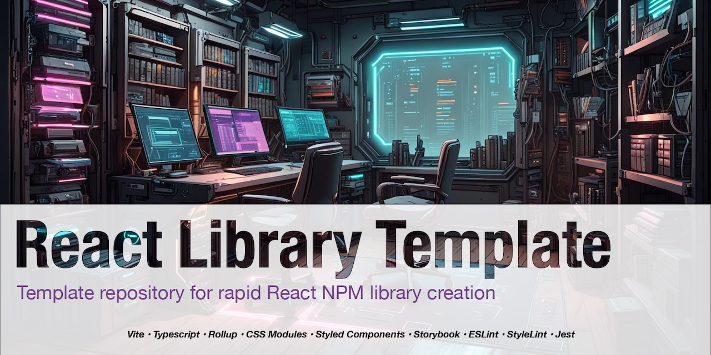

[](https://github.com/morewings/react-library-template/actions/workflows/merge-jobs.yml)
[](https://github.com/morewings/react-library-template/actions/workflows/pages.yml)
[](https://github.com/morewings/react-library-template/generate)

# React Library Template


[](#)

With React Library Template Repository, you can focus on developing your React components and libraries without worrying about the configuration and setup.

Read [full documentation](https://dev.to/morewings/fastest-way-to-create-a-react-library-3mi7).

Visit [Demo Storybook](https://morewings.github.io/react-library-template/).

## Features

- Supports **Typescript** and **Javascript**.
- Bundles `commonjs` and `es` module formats.
- [pnpm](https://pnpm.io/) for blazing fast package management.
- [Vite](https://vitejs.dev/) for speedy bundling
- [Husky](https://github.com/typicode/husky) for git hooks.
- [Eslint](https://eslint.org/) and [stylelint](https://stylelint.io/).
- [Rollup](https://rollupjs.org/guide/en/) for bundling.
- [Jest](https://jestjs.io/) and [react-testing-library](https://testing-library.com/docs/react-testing-library/intro) for testing.
- [Storybook](https://storybook.js.org/) for documentation and demo.
- Optional [Tailwind CSS](https://tailwindcss.com/) support.

## Quickstart

### Prerequisites

1. Install **Node** >= 20.x.
2. Install **pnpm**. E.g. `corepack prepare pnpm@latest --activate`.


### Installation

Manually clone repo or use `degit`.

```shell script
# With CSS Modules config
npx degit github:morewings/react-library-template my-library
# With Tailwind CSS config
npx degit github:morewings/react-library-template#tailwind my-library
cd ./my-library
pnpm i
```


## Enable Tailwind CSS

You can find all changes at this [PR](https://github.com/morewings/react-library-template/pull/161) and [tailwind](https://github.com/morewings/react-library-template/tree/tailwind) branch.
